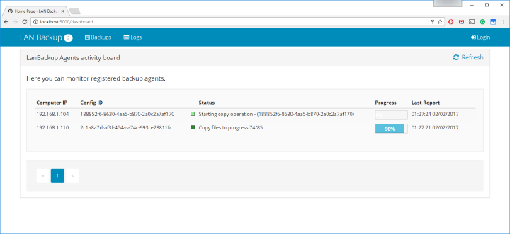

**Overview:**

The goal of this system is to allow centralized backup of certain specified data (files and folders) into designated storage locations, inside internal network of the organization.

Used technologies: **.NET**, **ASP.NET Core** SPA with **Angular2**

*System overview diagram:*


**Screenshots**





**Quick Start:**
- check prerequisite:
  - server:
    - .NET runtime https://www.microsoft.com/net/download/framework
    - .NET Core runtime https://www.microsoft.com/net/download/core#/runtime
    - IIS server installed (works also with IIS Express)
    - MSSQL (version 2012+) installed on machine (can be the express/community/dev)
  - clients: 
    - .NET runtime https://www.microsoft.com/net/download/framework
- download releases:
  - client: ...
  - server: ...
- install server package on the server machine:
  - follow the instructions to deploy on IIS from https://docs.microsoft.com/en-us/aspnet/core/publishing/iis
  - update the ***appsettings.json*** file with necesary info:
    - AdminEmail: to match your own admin email
    - ***DefaultConnection*** connection string to point to an instance of MSSQL - used to store user membership data.
    - ***BackupsConnectionString*** connection string to point to an instance of MSSQL - used to store application data.
  - default admin user is **admin@admin** with password **Admin$0**. Use it on first app run and change the password and eventually grant Admin role to other users as well.
- install agents setup on the client machines
  - configure "C:\Program Files (x86)\LanBackupAgent\LanBackupAgent.exe.config" file.
  - change **webApiUrl** setting to match your server IP and port configured above.
  - restart LanBackuAgent service in service console (*services.msc*).


**Application architecture**


**Database schema**


**Development Start**
- verify **prerequisite**:
  - Visual Studio 2015 with Update 3 (can be Community Edition https://go.microsoft.com/fwlink/?LinkId=691978)
  - .NET SDK (installed with VS2015)
  - .NET Core SDK https://www.microsoft.com/net/download/core#/sdk
  - IIS Express (installed with VS2015)
  - MSSQL (version 2012+) installed on machine (can be the express/community/dev) (https://www.microsoft.com/en-us/sql-server/sql-server-editions-express)
- **clone** this repo on your machine:

    ```
    git clone https://github.com/farcasclaudiu/LanBackup.git
    ```
- open solution in Visual Studio, all solution packages are available online and normally should **restore** by themself when opening the solution, wait for all packages to be restored automatically.
- Let's **build**
- set **startup** project ***LanBackup.WebApp***
- **RUN** the app (F5 or Ctrl+F5).
- Two databases defined in the project config file will be created automatically at the first run of the project. One database is for AspNetIdentity, the second is to hold app data.
- To configure Microsoft Azure **Application Insight** I recommend setting in project "LanBackup.WebApp" the ***user secret*** file with a structure like:

    ```
    {
      "clientSettings": {
        "AdminEmail": "personal@personal",
        "InstrumentationEnabled": true,
        "InstrumentationKey": "XXXXXXXX-XXXX-XXXX-XXXX-XXXXXXXXXXXX"
      },
      "ApplicationInsights": {
        "InstrumentationKey": "XXXXXXXX-XXXX-XXXX-XXXX-XXXXXXXXXXXX"
      }
    }
    ```
    here the "clientSettings" are specific for JS client side app (Angular2)
    and the "ApplicationInsights" part is used on the ASP.NET CORE side
- You might want to configure file "***.\LanBackup\.vs\config\applicationhost.config***" with appropiate binding info : IP and port, if you wish to test it in your network


**TODOs**
- Functional
  - show logs filtered by computer IP
  - paginated list with sorting and sort direction
- Deployment
  - configure install and run in docker container
- Testing
  - add more unit tests on webapi serverside
  - add more integrations tests on webapi server side
  - add more unit tests on angular client side


	